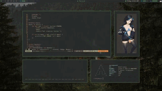

# DOTFILES : The Origin Story of a Hobbyist Programmer

*A five minute "lightening talk" for Code Nation's Master Course*

## A really knackered computer

Our story begins in the summer of 2018. 

Money was tight for me back then and my Windows 7 desktop machine was crashing with greater regularity.

"Turn it off and turn it on again" just didn't cut the mustard any more.

I was also getting nag alerts to install Windows 10, but my poor Dell clearly wasn't set up for that level of trauma.

I was too tight to throw the machine out, so I looked online for ways in which I might breathe new life into it instead.

I found a YouTube video on Linux Mint and decided that I had nothing to lose.


I didn't trust myself to burn my own USB stick as installation media, so I bought one from eBay pre-made instead.

I noticed a sharp uptick in performance with GNU/Linux and no crashes, so decided to use it at least until I could afford a more modern computer.

Since I was only using the browser most of the time, there wasn't a great deal of functional difference for me between the two systems.

## Ten GUI clicks vs One Command

If you google the question of how to do something on Windows vs the same question for Linux, you'll notice that the Windows advice is usually to click on ten different GUI interfaces, while the Linux advice is nearly always to open a terminal and type in a command.


I always associated the terminal with either software engineering or illegal activity, so to see that it had very mundane uses like changing my default browser sort of intruiged me.

For a while, I used to enter my sudo password, say "I'm in..." like a hacker in a bad 90s movie and then chuckle to myself like an idiot.

## Configuration

I soon discovered that Linux applications were usually configured by "dotfiles" or "dots".

These are hidden files and folders whose filename begins with a full-stop.

By default, your dots are hidden, but you can set your graphical file manager to show them.

In Bash, the command

```
ls -a
```

will include dotfiles when it lists the contents of the working directory.

Of course, dotfiles aren't just a GNU/Linux or MacOS thing.

If you use GitBash on Windows, then your terminal's behaviour can be set with .bashrc and .minttyrc dotfiles.

## RICE

The acronym RICE stands for "Racing Inspired Cosmetic Enhancement".

Although the term originated with car enthusiasts, it is also used by posters on the Unix Pron subreddit.



The rules over there specify that you have to post not just screenshots of your computer set-up, but also the technical specs of your RICE and a link to the code.

For a while, I was obssessed with tiling window managers, terminal apps, and highly configurable text editors like Vim and Emacs.

While most tiling window managers are configured via external files, both DWM and Xmonad have internal configuration files, which means that they are configured by editing the source code of the application itself and they both require recompilation for changes to take effect.

From my own experience, I am convinced that DWM is just an elaborate ruse to turn people into C programmers.

## Shifting focus

These days, I am more interested in earning a living through code than making naive teenagers on Reddit think that I'm a l33t h4x0r.

But I still have repos of basic dotfiles for MacOS, Arcolinux and FreeBSD as well as my own fork of DWM.

## Two commands, one gif

I didn't download that ricing gif. I created it.

First, I downloaded a youtube video of an Arch Linux rice with an alias for a yt-dlp command.

Then I used a function in my .zshrc file to call ffmpeg and imagemagick to convert a section of that video into a gif.

## If you only knew the power of a dotfile!


